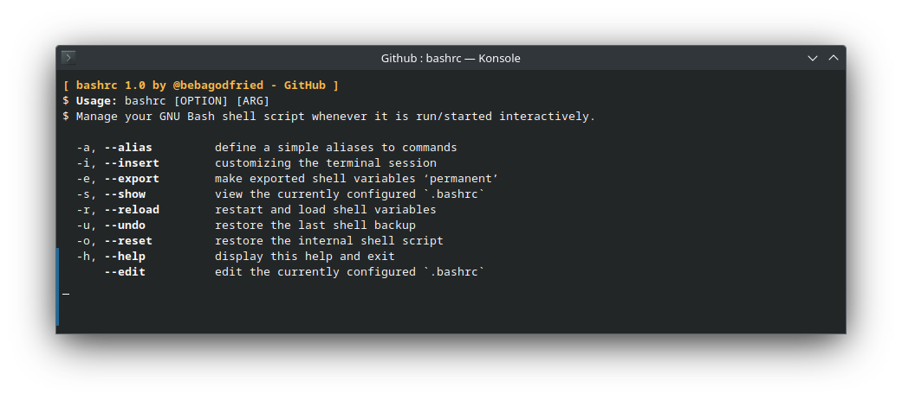

# `BASHRC - GNU/Linux`
#### Simple toolset for GNU Bash Shell execution
  ```
  💡.bashrc is a script that bash shell executes whenever it starts a new interactive session.
  ```
---

### Get started with 'BASHRC - GNU/Linux'
  This shell command \``bashrc`\` prupose to easy manage:
  - `.bashrc` interactive session
  - `$PATH` environement variables
  - and more...


---
###
- Download the [bashrc GNU/Linux](https://github.com/bebagodfried/bashrc) from GitHub
- Uncompress the downloaded file
- Initialize `'bashrc'` command
  ```
  $ cd /path/to/bashrc_folder
  $ sudo chmod 755 *
  $ ./bashrc
  ```
- All done. Now  you can personalize your bash shell execution

#### `!!!` Try the `'path'` command for simply manage your `$PATH`
---

#### NAME
    bashrc - command toolset for GNU bash shell execution

#### SYNOPSIS
    bashrc [OPTION] [ARG]

#### DESCRIPTION
    Manage GNU Bash Shell executes whenever it starts a new interactive session.  With no OPTION, same as -h

  ---
    -a, --alias         define a simple aliases to commands
    -i, --insert        customizing the terminal session
    -e, --export        make exported shell variables ‘permanent’
    -s, --show          view the currently configured `.bashrc`
    -r, --reload        restart and load shell variables
    -u, --undo          restore the last shell backup
    -o, --reset         restore the internal shell script
    -h, --help          display this help and exit
        --edit          edit the currently configured `.bashrc`

#### AUTHOR
    Written by Beba Godfried.

#### REPORTING BUGS
    GitHub help: [https://github.com/bebagodfried/bashrc]